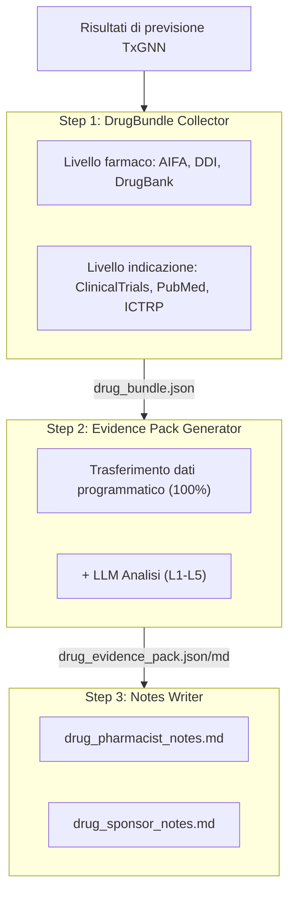
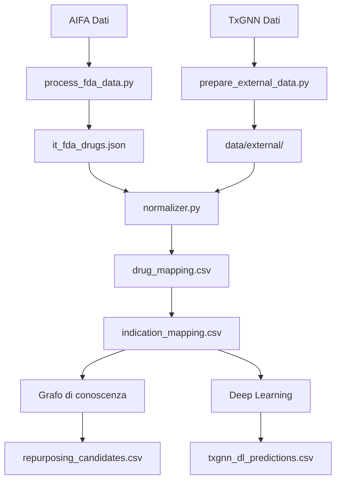

# ITTxGNN - Italia: Riposizionamento dei Farmaci

[](https://ittxgnn.yao.care)
[](https://opensource.org/licenses/MIT)

Previsioni di riposizionamento di farmaci per farmaci approvati da AIFA (Italy) utilizzando il modello TxGNN.

## Avvertenza

- I risultati di questo progetto sono solo a scopo di ricerca e non costituiscono consulenza medica.
- I candidati al riposizionamento dei farmaci richiedono una validazione clinica prima dell'applicazione.

## Panoramica del progetto

### Statistiche dei rapporti

| Elemento | Quantita |
|------|------|
| **Rapporti sui farmaci** | 333 |
| **Previsioni totali** | 7,794,696 |
| **Farmaci unici** | 407 |
| **Indicazioni uniche** | 16,985 |
| **Dati DDI** | 302,516 |
| **Dati DFI** | 857 |
| **Dati DHI** | 35 |
| **Dati DDSI** | 8,359 |
| **Risorse FHIR** | 333 MK / 1,860 CUD |

### Distribuzione dei livelli di evidenza

| Livello di evidenza | Numero di rapporti | Descrizione |
|---------|-------|------|
| **L1** | 0 | Multipli RCT di Fase 3 |
| **L2** | 0 | RCT singolo o multipli Fase 2 |
| **L3** | 0 | Studi osservazionali |
| **L4** | 0 | Studi preclinici / meccanicistici |
| **L5** | 333 | Solo previsione computazionale |

### Per fonte

| Fonte | Previsioni |
|------|------|
| DL | 7,792,836 |
| KG + DL | 1,617 |
| KG | 243 |

### Per fiducia

| Fiducia | Previsioni |
|------|------|
| very_high | 1,263 |
| high | 381,100 |
| medium | 722,747 |
| low | 6,689,586 |

---

## Metodi di previsione

| Metodo | Velocita | Precisione | Requisiti |
|------|------|--------|----------|
| Grafo di conoscenza | Veloce (secondi) | Inferiore | Nessun requisito speciale |
| Deep Learning | Lento (ore) | Superiore | Conda + PyTorch + DGL |

### Metodo del grafo di conoscenza

```bash
uv run python scripts/run_kg_prediction.py
```

| Metrica | Valore |
|------|------|
| AIFA Totale farmaci | 10,545 |
| Mappati a DrugBank | 5,481 (52.0%) |
| Candidati al riposizionamento | 1,860 |

### Metodo di deep learning

```bash
conda activate txgnn
PYTHONPATH=src python -m ittxgnn.predict.txgnn_model
```

| Metrica | Valore |
|------|------|
| Previsioni DL totali | 689,135 |
| Farmaci unici | 407 |
| Indicazioni uniche | 16,985 |

### Interpretazione dei punteggi

Il punteggio TxGNN rappresenta la fiducia del modello in una coppia farmaco-malattia, con un range da 0 a 1.

| Soglia | Significato |
|-----|------|
| >= 0.9 | Fiducia molto alta |
| >= 0.7 | Fiducia alta |
| >= 0.5 | Fiducia moderata |

#### Distribuzione dei punteggi

| Soglia | Significato |
|-----|------|
| ≥ 0.9999 | Confidenza estremamente alta, previsioni piu sicure del modello |
| ≥ 0.99 | Confidenza molto alta, da prioritizzare per la validazione |
| ≥ 0.9 | Confidenza alta |
| ≥ 0.5 | Confidenza moderata (confine decisionale sigmoide) |

#### Definizioni dei livelli di evidenza

| Livello | Definizione | Significato clinico |
|-----|------|---------|
| L1 | RCT di fase 3 o revisione sistematica | Puo supportare l'uso clinico |
| L2 | RCT di fase 2 | Puo essere considerato per l'uso |
| L3 | Fase 1 o studio osservazionale | Richiede ulteriore valutazione |
| L4 | Report di caso o ricerca preclinica | Non ancora raccomandato |
| L5 | Solo previsione computazionale, nessuna evidenza clinica | Richiede ulteriore ricerca |

#### Promemoria importanti

1. **Punteggi alti non garantiscono efficacia clinica: i punteggi TxGNN sono previsioni basate su grafi di conoscenza che richiedono validazione tramite studi clinici.**
2. **Punteggi bassi non significano inefficacia: il modello potrebbe non aver appreso certe associazioni.**
3. **Si consiglia l'uso con la pipeline di validazione: utilizzare gli strumenti di questo progetto per esaminare studi clinici, letteratura e altre prove.**

### Pipeline di validazione



---

## Avvio rapido

### Passo 1: Scaricare i dati

| File | Download |
|------|------|
| AIFA Dati | [AIFA - Liste Farmaci Classe A e H](https://www.aifa.gov.it/en/liste-farmaci-a-h) |
| node.csv | [Harvard Dataverse](https://dataverse.harvard.edu/api/access/datafile/7144482) |
| kg.csv | [Harvard Dataverse](https://dataverse.harvard.edu/api/access/datafile/7144484) |
| edges.csv | [Harvard Dataverse](https://dataverse.harvard.edu/api/access/datafile/7144483) |
| model_ckpt.zip | [Google Drive](https://drive.google.com/uc?id=1fxTFkjo2jvmz9k6vesDbCeucQjGRojLj) |

### Passo 2: Installare le dipendenze

```bash
uv sync
```

### Passo 3: Elaborare i dati sui farmaci

```bash
uv run python scripts/process_fda_data.py
```

### Passo 4: Preparare i dati del vocabolario

```bash
uv run python scripts/prepare_external_data.py
```

### Passo 5: Eseguire la previsione del grafo di conoscenza

```bash
uv run python scripts/run_kg_prediction.py
```

### Passo 6: Configurare l'ambiente di deep learning

```bash
conda create -n txgnn python=3.11 -y
conda activate txgnn
pip install torch==2.2.2 torchvision==0.17.2
pip install dgl==1.1.3
pip install git+https://github.com/mims-harvard/TxGNN.git
pip install pandas tqdm pyyaml pydantic ogb
```

### Passo 7: Eseguire la previsione di deep learning

```bash
conda activate txgnn
PYTHONPATH=src python -m ittxgnn.predict.txgnn_model
```

---

## Risorse

### TxGNN Nucleo

- [TxGNN Paper](https://www.nature.com/articles/s41591-024-03233-x) - Nature Medicine, 2024
- [TxGNN GitHub](https://github.com/mims-harvard/TxGNN)
- [TxGNN Explorer](http://txgnn.org)

### Fonti di dati

| Categoria | Dati | Fonte | Nota |
|------|------|------|------|
| **Dati sui farmaci** | AIFA | [AIFA - Liste Farmaci Classe A e H](https://www.aifa.gov.it/en/liste-farmaci-a-h) | Italy |
| **Grafo di conoscenza** | TxGNN KG | [Harvard Dataverse](https://dataverse.harvard.edu/dataset.xhtml?persistentId=doi:10.7910/DVN/IXA7BM) | 17,080 diseases, 7,957 drugs |
| **Database dei farmaci** | DrugBank | [DrugBank](https://go.drugbank.com/) | Mappatura ingredienti farmaci |
| **Interazioni farmacologiche** | DDInter 2.0 | [DDInter](https://ddinter2.scbdd.com/) | Coppie DDI |
| **Interazioni farmacologiche** | Guide to PHARMACOLOGY | [IUPHAR/BPS](https://www.guidetopharmacology.org/) | Interazioni farmaci approvati |
| **Sperimentazioni cliniche** | ClinicalTrials.gov | [CT.gov API v2](https://clinicaltrials.gov/data-api/api) | Registro sperimentazioni cliniche |
| **Sperimentazioni cliniche** | WHO ICTRP | [ICTRP API](https://apps.who.int/trialsearch/api/v1/search) | Piattaforma internazionale sperimentazioni cliniche |
| **Letteratura** | PubMed | [NCBI E-utilities](https://eutils.ncbi.nlm.nih.gov/entrez/eutils/) | Ricerca letteratura medica |
| **Mappatura dei nomi** | RxNorm | [RxNav API](https://rxnav.nlm.nih.gov/REST) | Standardizzazione nomi farmaci |
| **Mappatura dei nomi** | PubChem | [PUG-REST API](https://pubchem.ncbi.nlm.nih.gov/docs/pug-rest) | Ricerca sinonimi chimici |
| **Mappatura dei nomi** | ChEMBL | [ChEMBL API](https://www.ebi.ac.uk/chembl/api/data) | Database bioattivita |
| **Standard** | FHIR R4 | [HL7 FHIR](http://hl7.org/fhir/) | MedicationKnowledge, ClinicalUseDefinition |
| **Standard** | SMART on FHIR | [SMART Health IT](https://smarthealthit.org/) | Integrazione EHR, OAuth 2.0 + PKCE |

### Download dei modelli

| File | Download | Nota |
|------|------|------|
| Modello pre-addestrato | [Google Drive](https://drive.google.com/uc?id=1fxTFkjo2jvmz9k6vesDbCeucQjGRojLj) | model_ckpt.zip |
| node.csv | [Harvard Dataverse](https://dataverse.harvard.edu/api/access/datafile/7144482) | Dati nodi |
| kg.csv | [Harvard Dataverse](https://dataverse.harvard.edu/api/access/datafile/7144484) | Dati grafo di conoscenza |
| edges.csv | [Harvard Dataverse](https://dataverse.harvard.edu/api/access/datafile/7144483) | Dati archi (DL) |

## Introduzione al progetto

### Struttura delle directory

```
ITTxGNN/
├── README.md
├── CLAUDE.md
├── pyproject.toml
│
├── config/
│   └── fields.yaml
│
├── data/
│   ├── kg.csv
│   ├── node.csv
│   ├── edges.csv
│   ├── raw/
│   ├── external/
│   ├── processed/
│   │   ├── drug_mapping.csv
│   │   ├── repurposing_candidates.csv
│   │   ├── txgnn_dl_predictions.csv.gz
│   │   └── integration_stats.json
│   ├── bundles/
│   └── collected/
│
├── src/ittxgnn/
│   ├── data/
│   │   └── loader.py
│   ├── mapping/
│   │   ├── normalizer.py
│   │   ├── drugbank_mapper.py
│   │   └── disease_mapper.py
│   ├── predict/
│   │   ├── repurposing.py
│   │   └── txgnn_model.py
│   ├── collectors/
│   └── paths.py
│
├── scripts/
│   ├── process_fda_data.py
│   ├── prepare_external_data.py
│   ├── run_kg_prediction.py
│   └── integrate_predictions.py
│
├── docs/
│   ├── _drugs/
│   ├── fhir/
│   │   ├── MedicationKnowledge/
│   │   └── ClinicalUseDefinition/
│   └── smart/
│
├── model_ckpt/
└── tests/
```

**Legenda**: 🔵 Sviluppo progetto | 🟢 Dati locali | 🟡 Dati TxGNN | 🟠 Pipeline di validazione

### Flusso di dati



---

## Citazione

Se si utilizza questo set di dati o software, si prega di citare:

```bibtex
@software{ittxgnn2026,
  author       = {Yao.Care},
  title        = {ITTxGNN: Drug Repurposing Validation Reports for Italy AIFA Drugs},
  year         = 2026,
  publisher    = {GitHub},
  url          = {https://github.com/yao-care/ITTxGNN}
}
```

Citare anche l'articolo originale TxGNN:

```bibtex
@article{huang2023txgnn,
  title={A foundation model for clinician-centered drug repurposing},
  author={Huang, Kexin and Chandak, Payal and Wang, Qianwen and Haber, Shreyas and Zitnik, Marinka},
  journal={Nature Medicine},
  year={2023},
  doi={10.1038/s41591-023-02233-x}
}
```
